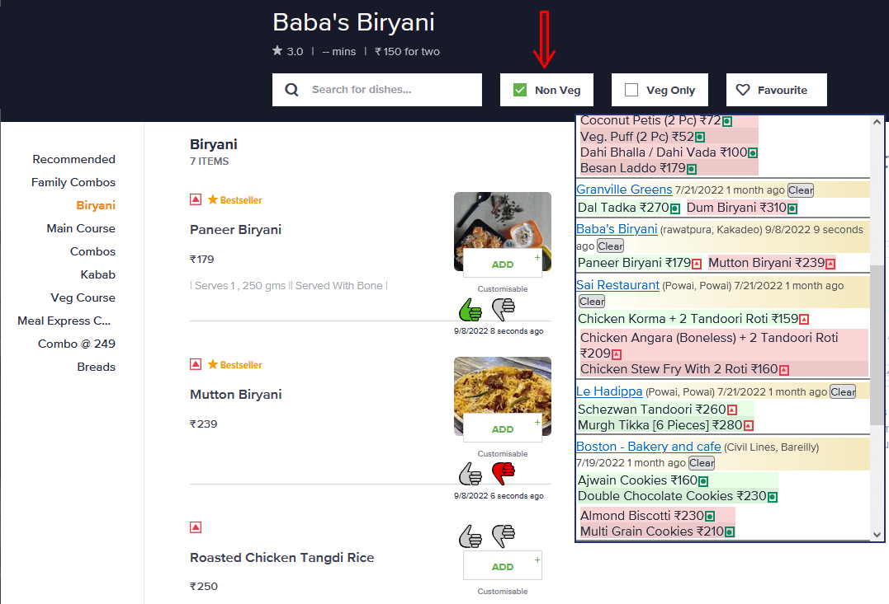

# Swiggy & Zomato: Non Veg dishes only

On Swiggy and Zomato you can select to show vegetarian dishes only, this script does the reverse: it allows you to hide vegetarian dishes

This is a userscript (or greasemonkey script), general information about userscripts and how to use them can be found at [openuserjs.org/about/Userscript-Beginners-HOWTO](https://openuserjs.org/about/Userscript-Beginners-HOWTO).

### Click [here](https://greasyfork.org/scripts/425352-swiggy-zomato-non-veg-dishes-only/code/Swiggy%20%20Zomato:%20Non%20Veg%20dishes%20only.user.js) to install this script

Screenshot:

